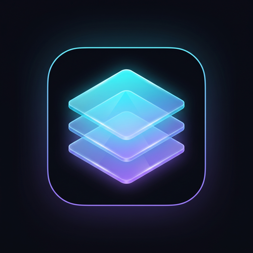
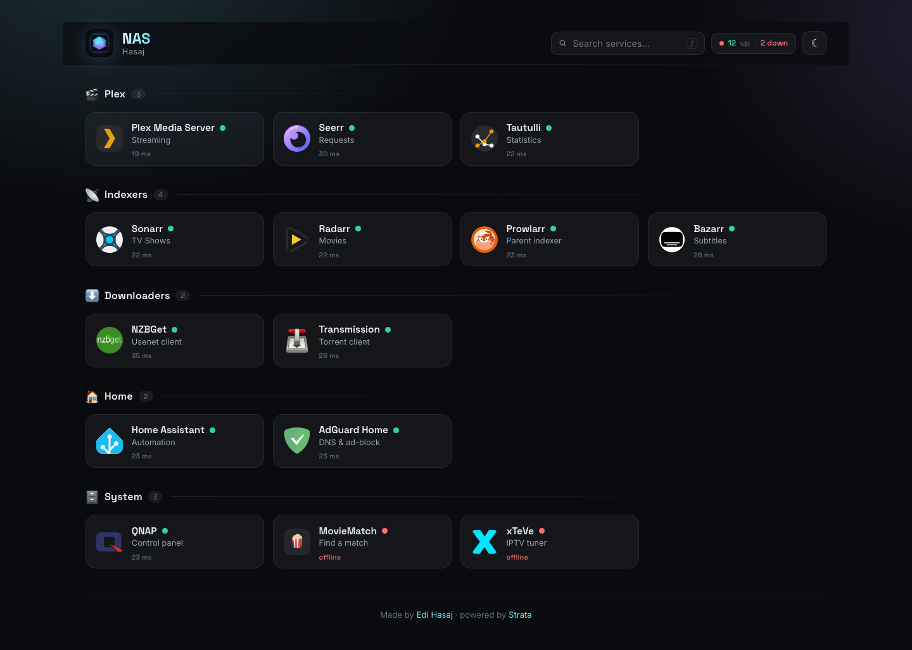
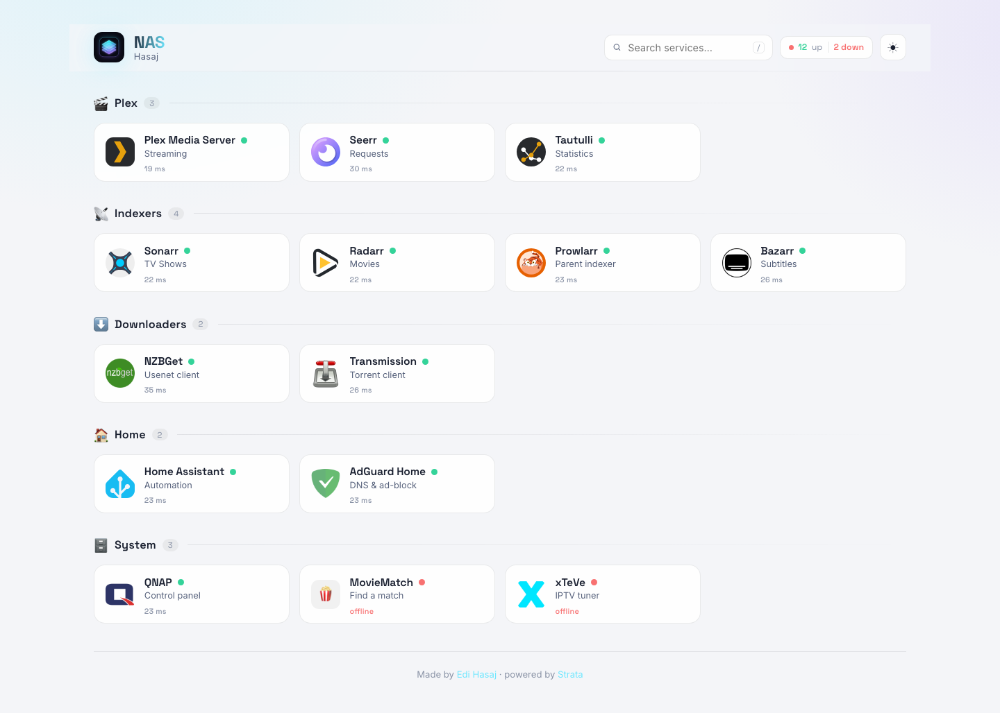
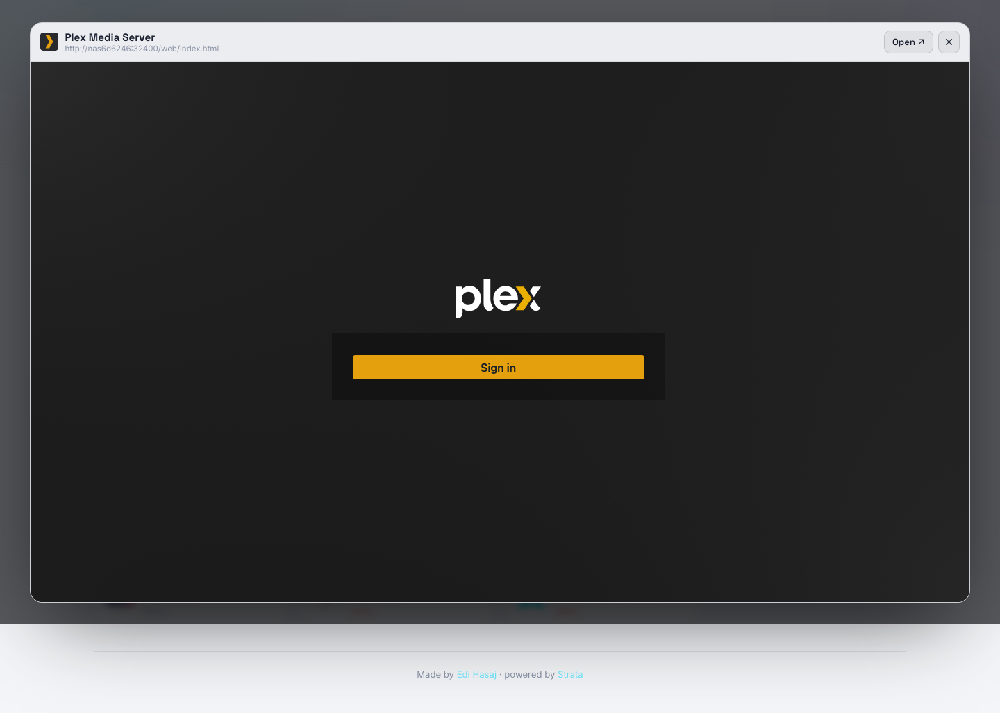
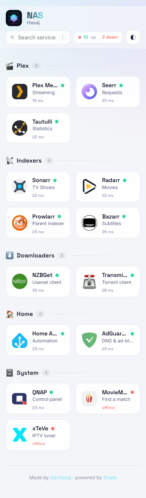

<div align="center">



# Strata

**A modern, YAML-driven homelab dashboard — with live status and live previews.**

Point it at your self-hosted services, describe them in one YAML file, and get a
fast, mobile-first dashboard that continuously shows what's up, how fast it's
responding, and lets you peek inside any app without leaving the page.

</div>

<div align="center">



</div>

## Why

[Homer](https://github.com/bastienwirtz/homer) is great, but static. Strata keeps
the part that makes Homer pleasant — **one YAML file, no database** — and adds the
things a homelab actually wants day to day:

- 🟢 **Live status** — the server probes every service and shows up / down **plus latency**, refreshed on an interval. Reachability, not a strict `2xx`, so apps that answer `401`/`302` at the root still read as online.
- 👁️ **Live preview** — click the eye on any card to load the real app in an in-page modal. No tab-juggling.
- 🔍 **Instant search** — press `/` and filter by name, subtitle, or tag.
- 📱 **Mobile-first** — a responsive grid that actually works on a phone.
- 🎨 **Distinctive by default** — committed palette, real typography (Space Grotesk + Inter), depth, and motion. Accent colors are yours to set.
- 🌗 **Light / dark / auto** — remembered per device.
- ♻️ **Homer-compatible** — an existing Homer `config.yml` drops in with minimal edits.

<table>
<tr>
<td width="50%"><p align="center"><em>Light theme</em></p></td>
<td width="50%"><p align="center"><em>Live preview, in-page</em></p></td>
</tr>
</table>

<div align="center">

<p><em>Mobile-first layout</em></p>
</div>

## Quick start

### Docker (recommended)

```bash
git clone https://github.com/edihasaj/strata.git
cd strata
cp config/config.example.yml config/config.yml   # then edit it
PORT=8080 docker compose up -d --build
```

Open `http://<host>:8080`. Edit `config/config.yml` and refresh — **no rebuild
needed** (the file is mounted into the container).

> Strata runs with `network_mode: host` so its server-side health probes can reach
> services published on the host. Set the port with the `PORT` env var.

### Local dev

```bash
pnpm install
pnpm dev        # http://localhost:5173
```

## Configuration

One file, `config/config.yml`:

```yaml
title: Homelab
subtitle: self-hosted
logo: /logo.png            # a path served from static/, or an emoji

theme:
  accent: '#6ee7ff'
  accent2: '#a78bfa'
  default: auto            # auto | dark | light

health:
  interval: 15000          # ms between client refreshes (min 5000)
  timeout: 4000            # ms per server-side probe

groups:
  - name: Media
    icon: '🎬'
    items:
      - name: Jellyfin
        subtitle: Streaming
        url: http://localhost:8096
        icon: /icons/jellyfin.svg   # image path OR an emoji
        tags: [media, video]        # searchable
        preview: true               # show the live-preview button
        # health: http://localhost:8096/health   # optional probe override
```

See [`config/config.example.yml`](config/config.example.yml) for the fully
annotated reference.

### Migrating from Homer

Strata accepts a `services:` block as an alias for `groups:`, and reads Homer's
`logo:` / `tag:` keys. In practice: copy your Homer `config.yml` in, drop the
top-level Homer-only keys you don't need, and you're running.

### Branding

`title`, `subtitle`, `logo`, `footer`, and the `theme` accents are all config —
make it yours. Drop your own `logo.png` into `static/` (or mount it) and set
`logo:` accordingly.

## How live status works

The browser can't probe internal hosts (CORS, private IPs), so Strata does it
**server-side**: `GET /api/health` fans out a short-timeout `HEAD` (falling back
to `GET`) to every service and returns a `{ url: { status, latency, code } }`
map, cached briefly. The client polls it and pauses while the tab is hidden.

## Tech

SvelteKit (Svelte 5 runes) · `adapter-node` · TypeScript · zero client
dependencies beyond the framework. Fonts are self-hosted (offline-friendly).

## Credits

- Built by **[Edi Hasaj](https://edihasaj.com)**.
- Service brand icons from the [Homer icons](https://github.com/bastienwirtz/homer) set; each icon is a trademark of its respective project.
- Fonts: [Space Grotesk](https://fonts.google.com/specimen/Space+Grotesk) & [Inter](https://rsms.me/inter/) (SIL Open Font License).

## License

[MIT](LICENSE) © Edi Hasaj
